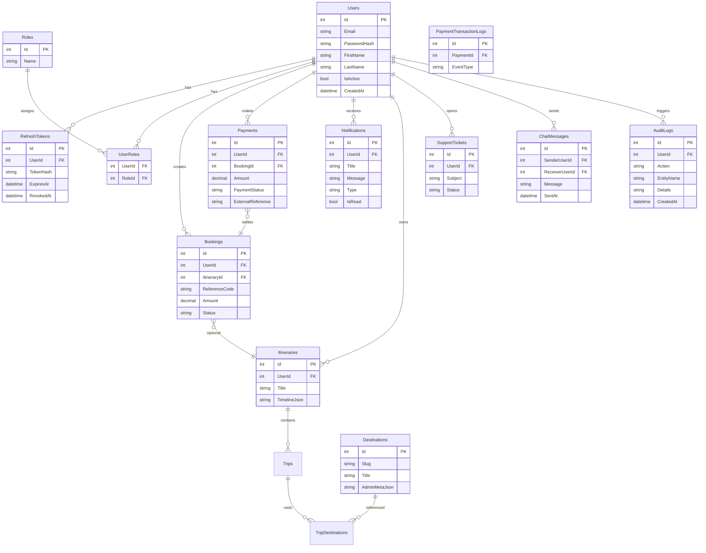

# Database ERD — lab2DB (Smart Travel Assistant)

Shared Azure SQL database `lab2DB` used by all microservices (table ownership per service).

## Service ownership

| Service | Tables |
|---------|--------|
| UserService | Users, RefreshTokens, Roles, UserRoles, TravelPreferences |
| ItineraryService | Itineraries, Trips, Destinations, UserSavedDestinations |
| BookingService | Bookings |
| PaymentService | Payments, PaymentTransactionLogs, Expenses |
| NotificationService | Notifications |
| SupportService | SupportTickets |
| RealTimeCommunicationService | ChatMessages |
| AuditService | AuditLogs |

Schema bootstrap: `server/Scripts/lab2DB-memberb-bootstrap.sql`
